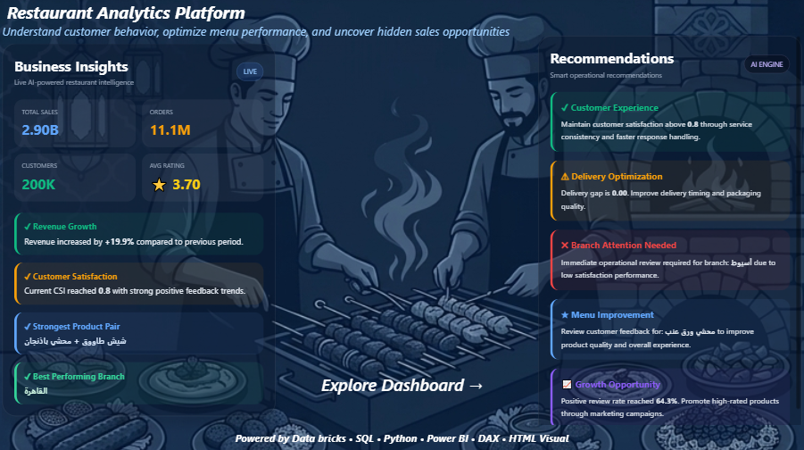
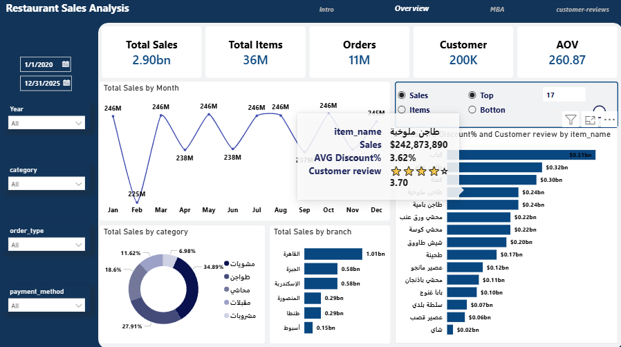
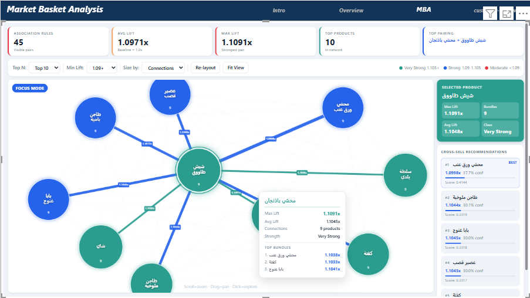
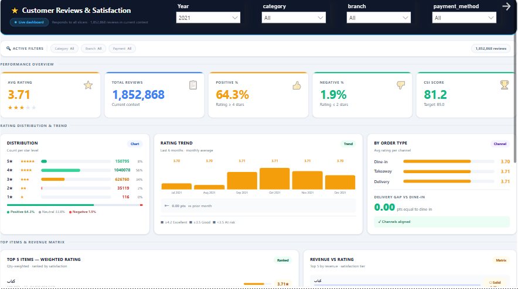

# Restaurant Analytics Platform

An advanced end-to-end Restaurant Analytics Platform built using:

* Power BI
* DAX
* SQL
* Databricks
* Python
* HTML Visuals

---

## Project Overview

This project transforms raw restaurant transactional data into a fully interactive analytics platform focused on:

* Sales Performance
* Customer Satisfaction
* Market Basket Analysis
* AI-driven Recommendations
* KPI Monitoring

---

## Dashboard Pages

### 1. Intro Page

AI-powered landing page with dynamic insights and recommendations.

### 2. Sales Overview

Interactive sales dashboard including:

* Revenue
* Orders
* Customers
* AOV
* Branch Performance
* Category Analysis

### 3. Market Basket Analysis

Advanced association rule mining visualization:

* Product relationships
* Lift / Confidence metrics
* Network graph analysis
* Cross-sell opportunities

### 4. Customer Reviews Analytics

Customer satisfaction intelligence dashboard:

* CSI Score
* Rating Distribution
* Review Trends
* Delivery Gap Analysis
* Revenue vs Rating Matrix

---

## Technologies Used

| Technology | Usage                 |
| ---------- | --------------------- |
| Power BI   | Dashboard Development |
| DAX        | Measures & KPIs       |
| SQL        | Data Modeling         |
| Databricks | Data Processing       |
| Python     | Analytics             |
| HTML/CSS   | Custom Visual Design  |

---

## Features

* Advanced HTML visuals inside Power BI
* AI-style insights panels
* Dynamic KPI cards
* Interactive MBA Network Graph
* Responsive dashboard design
* Dark modern UI

---

## Screenshots

### Intro Page

### Sales Overview

### Market Basket Analysis

### Customer Reviews

---

## Author

Mohamed Bahaaeldien
